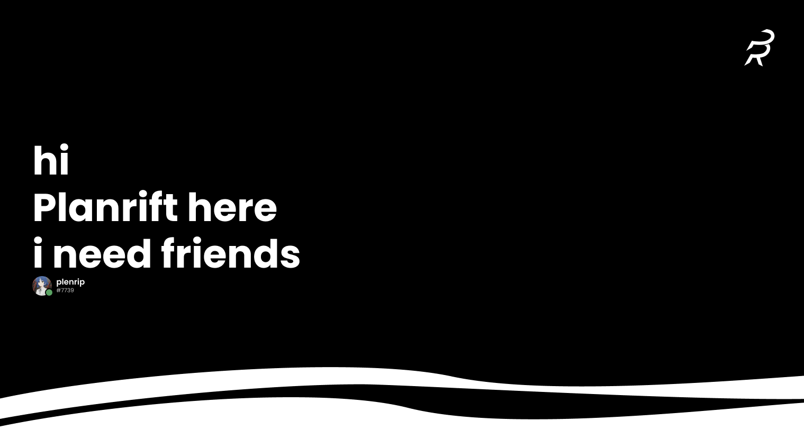
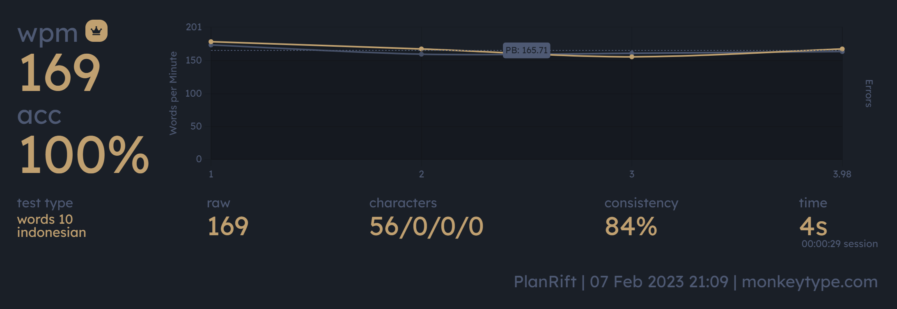
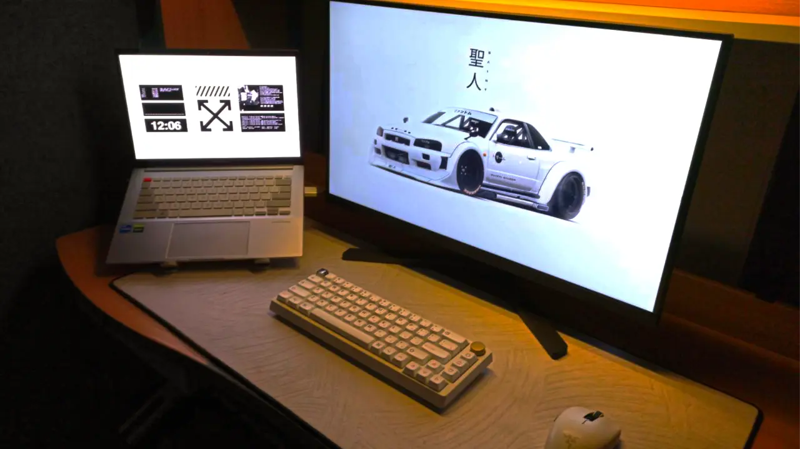
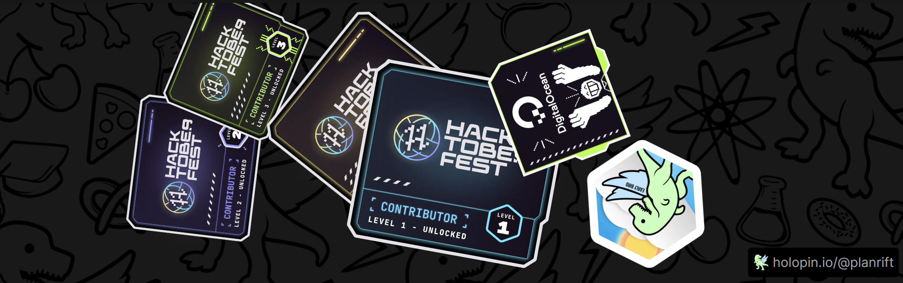

<h3 align="center"> A Young Web Developer X Designer From Indonesia</h3>

# 💫 About Me:
🏫A student from IDN Boarding School 📖Currently learning about PHP 🏎️A fan of Cars, Keyboards, and Women? 🤝Add me on Discord plenrip#7739 💻Come and visit my website! [planrift.github.io](https://planrift.github.io) 📄 My Resume [s.id/1xN0F](https://s.id/1xN0F)

    

            	 

<h3 align="center"> I can type pretty fast I think</h3>

<h4 align="center"> This ain't my vid but it looks cool so ima put it here </h4>

<h4 align="center"> My Laptop Setup </h4>

 

 

<h3>💻ASUS Vivobook PRO 14x OLED</h3>
<h5 margin-left="0.5rem">-Intel Core i5-11300H -Nvidia RTX 3050 Studio -OLED 2k 90hz Screen -16GB Ram</h5>
<h3>🖱️Peripherals</h3>
<h5 margin-left="0.5rem">-Mouse = Razer OROCHI v2 -Keyboard = Custom 65% Keyboard -External Monitor = Koorui 2k 144hz </h5>
<h3>⌨️Keyboard</h3>
<h5 margin-left="0.5rem">-Digital Alliance Meca 6 Plus -Lubed Gateron Yellows -MOMO KON Keycaps Set -Foam Dampener -Self Painted Gold Knob -Resin Artisan Keycap</h5>

